# Laboratorio1-Fortigate-SR

**Merolyn Mejía Abreu**  
**Matrícula:** 2025-0827  

**Plataforma:** GNS3  
**Firewall:** FortiGate-VM64-KVM v7.0.9  
**Configuración de FortiGate:** Interfaz gráfica (GUI)

> Laboratorio de seguridad de redes implementado en GNS3 utilizando FortiGate como firewall. La infraestructura integra segmentación mediante VLANs, direccionamiento IP, DHCP, NAT, políticas de firewall, inspección profunda SSL (DPI), IPS, filtrado de archivos y mecanismos de protección contra ataques DoS.

---

## Link de la demostración en video

**Enlace del video:** Pendiente de agregar

---

## Propósito del laboratorio

El propósito de este laboratorio es implementar una infraestructura de red segura utilizando **FortiGate como firewall principal**, aplicando diferentes mecanismos de protección y control del tráfico entre usuarios, servidores e Internet.

La práctica busca poner en funcionamiento una red segmentada mediante VLANs, donde los usuarios y servidores se encuentren en redes diferentes y el tráfico sea controlado mediante políticas de firewall.

También se implementan servicios y mecanismos de seguridad como DHCP, NAT, inspección profunda de tráfico SSL (DPI), IPS, filtrado de archivos y protección contra ataques DoS, además de controles de seguridad en el switch y restricciones de comunicación entre los diferentes equipos de la red.

Finalmente, se realizan pruebas para comprobar que las políticas y controles configurados funcionan de acuerdo con los requisitos establecidos para el laboratorio.

---

## Tabla de contenido

1. [Propósito del laboratorio](#propósito-del-laboratorio)
2. [Topología de red](#topología-de-red)
3. [Tabla de direccionamiento](#tabla-de-direccionamiento)
4. [Funcionamiento de la configuración](#funcionamiento-de-la-configuración)
5. [Configuraciones implementadas](#configuraciones-implementadas)
6. [Políticas de seguridad](#políticas-de-seguridad)
7. [Validación y pruebas](#validación-y-pruebas)
8. [Diagramas y evidencias](#diagramas-y-evidencias)
9. [Running Configurations](#running-configurations)
10. [Scripts y archivos utilizados](#scripts-y-archivos-utilizados)
11. [Conclusión](#conclusión)

---

## Topología de red

La infraestructura del laboratorio fue diseñada y ejecutada en **GNS3**. El FortiGate funciona como el dispositivo principal de seguridad y controla la comunicación entre la red de usuarios, la red de servidores y la salida hacia Internet.

La topología está compuesta por:

- **1 FortiGate** como firewall principal.
- **1 switch** para la conexión y segmentación de los dispositivos.
- **1 equipo Windows** perteneciente a la VLAN 10 de usuarios.
- **1 WEB Server** con servicio HTTPS.
- **1 DB Server** con servicio MySQL.
- **2 VLANs principales:** VLAN 10 para usuarios y VLAN 20 para servidores.
- **Conexión WAN** para proporcionar acceso hacia Internet mediante NAT.

### Diagrama de la topología


> La VLAN 10 utiliza una red /25, mientras que la VLAN 20 utiliza una red /28. El FortiGate funciona como gateway de ambas redes y aplica las políticas de seguridad correspondientes.

---

## Tabla de direccionamiento

La infraestructura utiliza dos redes internas principales: una red /25 destinada a los usuarios y una red /28 destinada a los servidores. Además, FortiGate dispone de una interfaz WAN para la comunicación hacia Internet.

| Dispositivo / Interfaz | VLAN / Zona | Dirección IP | Máscara / Prefijo | Gateway | Función |
|---|---|---|---|---|---|
| FortiGate `port1` | WAN | 192.168.157.155 | /24 | Asignado por DHCP | Conexión hacia Internet |
| FortiGate VLAN 10 | VLAN 10 - Usuarios | 10.8.27.1 | /25 | — | Gateway de usuarios |
| Windows Usuario | VLAN 10 - Usuarios | 10.8.27.3 | /25 | 10.8.27.1 | Equipo cliente por DHCP |
| FortiGate VLAN 20 | VLAN 20 - Servidores | 10.8.27.129 | /28 | — | Gateway de servidores |
| WEB Server | VLAN 20 - Servidores | 10.8.27.130 | /28 | 10.8.27.129 | Servidor web HTTPS |
| DB Server | VLAN 20 - Servidores | 10.8.27.131 | /28 | 10.8.27.129 | Servidor MySQL |

### Redes utilizadas

| Segmento | Red | Rango utilizado | Gateway |
|---|---|---|---|
| VLAN 10 - Usuarios | 10.8.27.0/25 | 10.8.27.2 - 10.8.27.126 mediante DHCP | 10.8.27.1 |
| VLAN 20 - Servidores | 10.8.27.128/28 | Direccionamiento estático | 10.8.27.129 |
| WAN | 192.168.157.0/24 | Dirección obtenida mediante DHCP | Red NAT de VMware |

> Los usuarios reciben automáticamente su configuración IPv4 mediante DHCP, mientras que los servidores utilizan direcciones estáticas para garantizar que las políticas de seguridad siempre hagan referencia a direcciones conocidas.

---

## Funcionamiento de la configuración

La red fue diseñada para que el FortiGate sea el punto principal de control y seguridad entre los usuarios, los servidores e Internet.

### Red de usuarios

Los equipos de usuarios pertenecen a la VLAN 10 y reciben automáticamente su direccionamiento mediante DHCP. El FortiGate utiliza la dirección `10.8.27.1/25` como gateway de esta red.

Desde esta VLAN, las políticas del firewall determinan a cuáles servicios internos pueden acceder los usuarios.

### Red de servidores

El WEB Server y el DB Server pertenecen a la VLAN 20, utilizando direccionamiento estático dentro de la red `10.8.27.128/28`.

El WEB Server utiliza la dirección `10.8.27.130` y ofrece el servicio HTTPS, mientras que el DB Server utiliza `10.8.27.131` y proporciona el servicio MySQL mediante el puerto TCP/3306.

### Control mediante FortiGate

FortiGate controla el tráfico entre las diferentes redes mediante políticas de firewall.

Los usuarios pueden acceder al WEB Server mediante HTTPS/443, mientras que el acceso directo desde la VLAN de usuarios hacia el DB Server por MySQL/3306 se encuentra bloqueado.

De esta forma, los usuarios interactúan con el servicio web sin tener acceso directo a la base de datos.

> Durante las pruebas controladas de IPS y File Filter se habilitó adicionalmente el servicio TCP/8080 en la política `USUARIOS-WEB-HTTPS`.

### Comunicación WEB Server → DB Server

El WEB Server puede comunicarse con el DB Server mediante TCP/3306, necesario para el funcionamiento de MySQL.

Como ambos servidores se encuentran dentro de la misma VLAN y este tráfico no atraviesa normalmente el FortiGate, se implementó una restricción adicional mediante el firewall **UFW del DB Server**, permitiendo el puerto 3306 desde el WEB Server y bloqueando conexiones entrantes no autorizadas.

### Acceso a Internet y NAT

La interfaz WAN `port1` del FortiGate obtiene su configuración mediante DHCP y proporciona la salida hacia Internet.

La ruta por defecto hacia la red externa es obtenida dinámicamente mediante DHCP en la interfaz WAN. Mediante NAT, las redes internas autorizadas pueden comunicarse con redes externas sin exponer directamente sus direcciones IPv4 privadas.

### Inspección y protección

Además del control mediante políticas, FortiGate utiliza mecanismos adicionales de seguridad como Deep Packet Inspection (DPI), IPS, filtrado de archivos y protección contra ataques DoS.

La inspección profunda SSL permite analizar tráfico HTTPS según la política configurada, mientras que IPS permite aplicar mecanismos de detección y prevención sobre el tráfico inspeccionado.

El filtrado de archivos se utiliza para establecer restricciones sobre determinados tipos de archivos y la política DoS permite aplicar controles frente a cantidades anormales de conexiones dirigidas al servidor web.

---

## Configuraciones implementadas

Durante el desarrollo del laboratorio se realizaron configuraciones tanto en FortiGate como en el switch y los servidores para garantizar la segmentación, conectividad y seguridad de la infraestructura.

### FortiGate

En el firewall FortiGate se implementaron las siguientes configuraciones:

- Configuración de la interfaz WAN `port1` mediante DHCP.
- Creación de las interfaces correspondientes a la VLAN 10 y VLAN 20.
- Configuración del gateway para las redes de usuarios y servidores.
- Servicio DHCP para la VLAN 10.
- Obtención dinámica de la ruta por defecto mediante DHCP en la interfaz WAN.
- NAT para proporcionar acceso hacia Internet.
- Creación de objetos para identificar el WEB Server y el DB Server.
- Políticas de firewall para controlar el tráfico entre usuarios y servidores.
- Deep Packet Inspection mediante el perfil `custom-deep-inspection`.
- Perfil IPS `SQL-INJECTION-PROTECTION`.
- File Filter `BLOCK-EXE-DOWNLOADS`.
- Política DoS `PROTECCION-DOS-WEB`.
- Registro de tráfico para facilitar la validación y monitoreo de las políticas.

### Switch

En el switch se realizaron las siguientes configuraciones:

- Creación y asignación de VLANs.
- Configuración del enlace trunk hacia FortiGate.
- Asignación de puertos de acceso para usuarios y servidores.
- Implementación de Port Security.
- Máximo de 2 direcciones MAC por puerto protegido.
- Sticky MAC para aprendizaje de direcciones.
- Modo de violación `shutdown`.
- Desactivación administrativa de los puertos no utilizados.
- Almacenamiento de la configuración en `startup-config`.

### WEB Server

El WEB Server fue configurado con:

- Dirección IPv4 estática `10.8.27.130/28`.
- Gateway `10.8.27.129`.
- Servicio Apache.
- Servicio web mediante HTTPS/443.
- Certificado para permitir conexiones HTTPS.
- Comunicación autorizada con el DB Server mediante TCP/3306.

### DB Server

El servidor de base de datos fue configurado con:

- Dirección IPv4 estática `10.8.27.131/28`.
- Gateway `10.8.27.129`.
- Servicio MySQL mediante TCP/3306.
- Firewall UFW habilitado.
- Acceso a TCP/3306 permitido desde el WEB Server.
- Restricción de conexiones entrantes no autorizadas.

### Equipo de usuario

El equipo Windows utilizado para las pruebas pertenece a la VLAN 10 y obtiene automáticamente mediante DHCP:

- Dirección IPv4.
- Máscara de red.
- Gateway predeterminado.

Este equipo se utiliza para comprobar las políticas de acceso, inspección y seguridad aplicadas por FortiGate.

---

## Políticas de seguridad

Las políticas de seguridad fueron implementadas para controlar la comunicación entre los usuarios, los servidores y las redes externas, aplicando el principio de permitir únicamente el tráfico necesario.

| Política / Control | Origen | Destino | Servicio | Acción | Propósito |
|---|---|---|---|---|---|
| `USUARIOS-WEB-HTTPS` | VLAN 10 - Usuarios | WEB Server | HTTPS/443 | Permitir | Permitir a los usuarios acceder de forma segura al servidor web |
| `BLOQUEO-USUARIOS-DB` | VLAN 10 - Usuarios | DB Server | MySQL/3306 | Bloquear | Evitar el acceso directo de los usuarios a la base de datos |
| `SERVERS-INTERNET` | VLAN 20 - Servidores | Internet | ALL | Permitir + NAT | Proporcionar conectividad externa a los servidores |
| `PROTECCION-DOS-WEB` | VLAN 10 - Usuarios | WEB Server | HTTPS | Bloquear al superar el umbral | Proteger el servidor web frente a cantidades anormales de conexiones |
| UFW DB Server | WEB Server | DB Server | TCP/3306 | Permitir | Permitir únicamente la comunicación necesaria hacia MySQL |

> Durante las pruebas controladas de IPS y File Filter se agregó temporalmente el servicio `TCP-8080` a la política `USUARIOS-WEB-HTTPS`.

### Deep Packet Inspection

La política `USUARIOS-WEB-HTTPS` utiliza el perfil:

`custom-deep-inspection`

Este perfil permite realizar inspección profunda del tráfico SSL/TLS. Durante las pruebas se verificó mediante los registros de FortiGate que el tráfico HTTPS estaba siendo procesado por el perfil de inspección configurado.

### IPS

Se creó el perfil:

`SQL-INJECTION-PROTECTION`

Este perfil fue configurado para detectar y bloquear intentos de SQL Injection dirigidos al WEB Server.

Para la protección se utilizó la firma:

`HTTP.URI.SQL.Injection`

La firma se encuentra configurada con acción **Block** y **Packet Logging** habilitado.

Durante las pruebas, FortiGate detectó intentos de SQL Injection realizados desde el equipo de usuarios `10.8.27.3` hacia el WEB Server `10.8.27.130`.

Los eventos fueron identificados como `HTTP.URI.SQL.Injection` y FortiGate aplicó la acción `dropped`, impidiendo que las solicitudes detectadas llegaran al servidor web. Los eventos también quedaron registrados en **Log & Report → Intrusion Prevention**, permitiendo verificar el origen, destino, política aplicada y nivel de amenaza.

> La detección, bloqueo y registro de los intentos de SQL Injection fueron comprobados correctamente. La validación de la cuarentena del equipo atacante se mantiene pendiente.

### Filtrado de archivos

Se creó el perfil:

`BLOCK-EXE-DOWNLOADS`

Dentro del perfil se configuró la regla:

`BLOCK-EXE`

La regla fue configurada para inspeccionar tráfico HTTP entrante e identificar archivos de tipo `.exe`, aplicando la acción **Block** cuando se detecta este tipo de archivo.

Durante la validación se intentó acceder al archivo `prueba.exe` alojado en el WEB Server. FortiGate interceptó la solicitud y mostró una página de bloqueo indicando que el archivo había sido bloqueado debido a su tipo o propiedades.

El evento también quedó registrado en **Log & Report → File Filter**, donde se comprobó:

- **File Name:** `prueba.exe`
- **File Type:** `exe`
- **Action:** `blocked`
- **Service:** `HTTP`
- **Policy:** `USUARIOS-WEB-HTTPS (2)`

> El bloqueo de archivos ejecutables `.exe` fue configurado, probado y registrado correctamente.

### Protección DoS

Se implementó la política:

`PROTECCION-DOS-WEB`

La política protege el WEB Server frente a cantidades anormales de solicitudes TCP SYN y tiene configurado:

- **Anomalía:** `tcp_syn_flood`
- **Acción:** `Block`
- **Logging:** habilitado
- **Threshold:** `2000`

Esta configuración proporciona un mecanismo adicional de protección para el servicio web.

---

## Validación y pruebas

Después de implementar las configuraciones, se realizaron diferentes pruebas para verificar la conectividad y el funcionamiento de los controles de seguridad.

| Prueba realizada | Resultado |
|---|---|
| Windows obtiene direccionamiento mediante DHCP |  Exitoso |
| Windows alcanza su gateway `10.8.27.1` |  Exitoso |
| Acceso de Usuarios al WEB Server mediante HTTPS/443 |  Permitido |
| Acceso de Usuarios al DB Server mediante MySQL/3306 |  Bloqueado |
| WEB Server → DB Server mediante TCP/3306 |  Permitido |
| WEB Server → DB Server mediante un puerto no autorizado |  Bloqueado |
| Salida hacia Internet mediante NAT |  Exitoso |
| Deep Packet Inspection sobre HTTPS |  Verificado mediante logs |
| Port Security en los puertos protegidos |  Configurado y verificado |
| Puertos no utilizados del switch |  Deshabilitados |
| Protección DoS del WEB Server |  Configurada |
| Detección de SQL Injection |  Detectado por IPS |
| Bloqueo de SQL Injection |  Bloqueado (`dropped`) |
| Registro del evento SQL Injection |  Registrado en Intrusion Prevention |
| Bloqueo de descarga de archivo `.exe` |  Bloqueado |
| Registro del bloqueo de archivo `.exe` |  Registrado en File Filter |
| Cuarentena del equipo atacante | Equipo atacante colocado en cuarentena |

### Validación de HTTPS

Desde el equipo Windows 10 se comprobó el acceso al WEB Server mediante:

`https://10.8.27.130`

El servidor Apache respondió correctamente mediante HTTPS/443.

### Validación del acceso al DB Server

Se comprobó que el equipo de la VLAN 10 no puede establecer una conexión directa con el DB Server mediante TCP/3306, validando la política de bloqueo configurada en FortiGate.

Por otro lado, desde el WEB Server se comprobó que TCP/3306 hacia el DB Server se encuentra permitido, mientras que las conexiones hacia puertos no autorizados son rechazadas por el firewall del servidor.

### Validación de SQL Injection

Durante las pruebas de seguridad, FortiGate detectó intentos de SQL Injection provenientes del equipo de usuarios con dirección IP `10.8.27.3` hacia el WEB Server.

El perfil IPS `SQL-INJECTION-PROTECTION` identificó el tráfico mediante la firma `HTTP.URI.SQL.Injection` y aplicó la acción `dropped`, bloqueando las solicitudes detectadas.

Los eventos quedaron registrados en **Log & Report → Intrusion Prevention**, permitiendo comprobar el origen, destino, política aplicada y acción ejecutada por FortiGate.

### Cuarentena del equipo atacante

Como parte de la respuesta ante los intentos de SQL Injection, el equipo identificado como origen del tráfico malicioso, con dirección IP `10.8.27.3`, fue colocado en cuarentena mediante FortiGate.

La cuarentena permitió aislar temporalmente el dispositivo para impedir que continuara generando conexiones hacia los recursos protegidos de la red.

Posteriormente, se verificó desde FortiGate que el dispositivo aparecía dentro de los equipos en cuarentena.

> La detección, bloqueo, registro y cuarentena del equipo atacante fueron comprobados correctamente.

### Validación del bloqueo de archivos `.exe`

Se realizó una prueba utilizando el archivo `prueba.exe` alojado en el WEB Server.

Al intentar acceder al archivo desde el equipo Windows, FortiGate detectó el tipo de archivo y bloqueó la descarga mediante el perfil `BLOCK-EXE-DOWNLOADS`.

El bloqueo fue confirmado mediante la página de reemplazo mostrada por FortiGate y mediante los registros de **File Filter**, donde el evento apareció con la acción `blocked`.

### Validación de la protección DoS

Se verificó la configuración de la política `PROTECCION-DOS-WEB` aplicada al tráfico HTTPS dirigido hacia el WEB Server.

La anomalía `tcp_syn_flood` se encuentra habilitada con acción `Block`, registro de eventos habilitado y un umbral configurado de `2000`.

> La evidencia presentada corresponde a la configuración y verificación de la política de protección DoS.

---

## Diagramas y evidencias

Esta sección contiene las evidencias visuales de las configuraciones y pruebas realizadas durante la implementación del laboratorio.

Las capturas se encuentran almacenadas en:

`DOCUMENTACION/Imagenes/`

### Evidencia 01 — Topología de red

Topología general implementada en GNS3 con FortiGate, switch, equipo de usuarios, WEB Server, DB Server y conexión hacia la red externa.

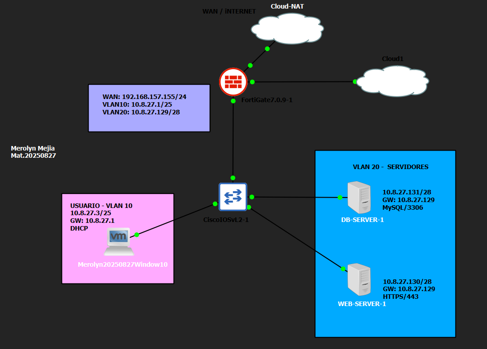

### Evidencia 02 — Configuración de VLANs en FortiGate

Configuración de las interfaces correspondientes a las redes de usuarios y servidores en FortiGate.

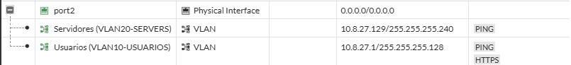

### Evidencia 03 — Direccionamiento obtenido por el equipo Windows

Configuración IPv4 obtenida por el equipo Windows perteneciente a la VLAN 10 de usuarios.

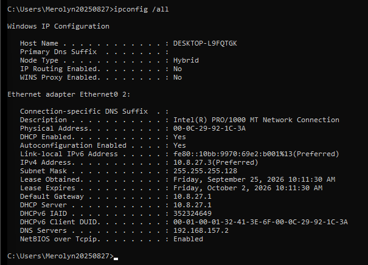

### Evidencia 04 — Ruta por defecto

Verificación de la ruta utilizada para proporcionar conectividad hacia la red externa.

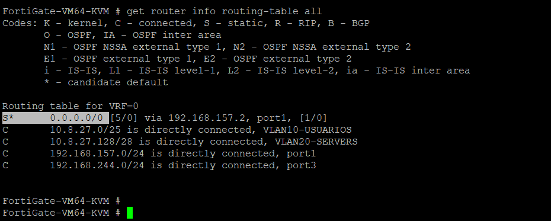

### Evidencia 05 — Política de NAT

Configuración de la política utilizada para proporcionar salida hacia Internet mediante NAT.

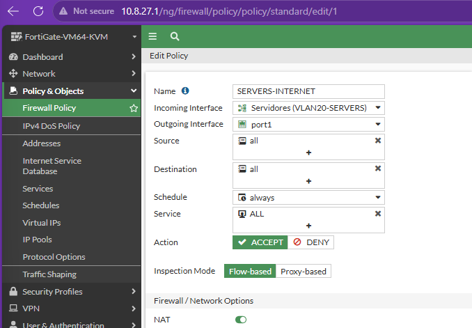

### Evidencia 06 — Prueba de conectividad hacia Internet

Prueba realizada desde un servidor para comprobar la conectividad hacia Internet.

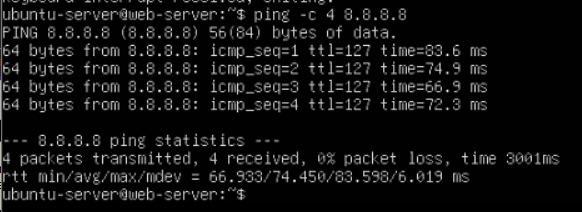

### Evidencia 07 — Política Usuarios → WEB Server

Política de FortiGate que permite la comunicación desde la VLAN de usuarios hacia el WEB Server.

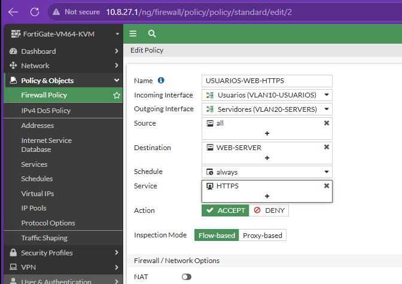

### Evidencia 08 — Acceso HTTPS al WEB Server

Acceso al servicio Apache del WEB Server desde el equipo de usuarios.

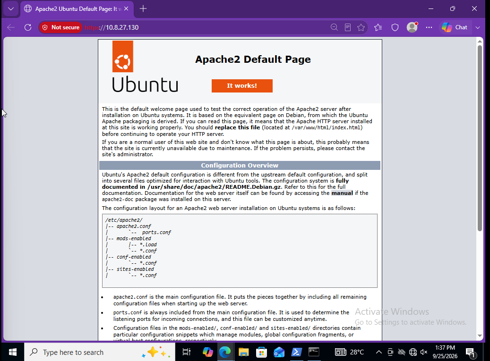

### Evidencia 09 — Prueba del puerto HTTPS/443

Validación de la conectividad desde el equipo Windows hacia el WEB Server mediante TCP/443.

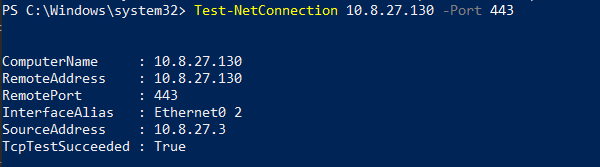

### Evidencia 10 — Bloqueo Usuarios → DB Server

Prueba de conexión desde el equipo Windows hacia el DB Server mediante TCP/3306, donde se comprueba que el acceso directo se encuentra bloqueado.

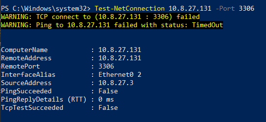

### Evidencia 11 — Política de bloqueo hacia el DB Server

Política `BLOQUEO-USUARIOS-DB` configurada para impedir el acceso directo de los usuarios al servicio MySQL del DB Server.

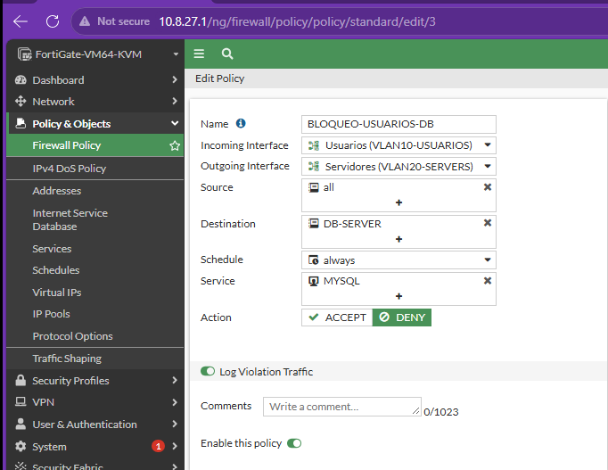

### Evidencia 12 — Comunicación WEB Server → DB Server

Validación de la comunicación permitida desde el WEB Server hacia el DB Server mediante TCP/3306.

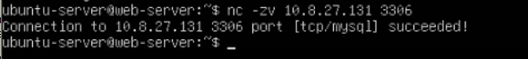

### Evidencia 13 — Bloqueo de puerto no autorizado

Prueba desde el WEB Server hacia un puerto no autorizado del DB Server, comprobando la restricción aplicada mediante UFW.

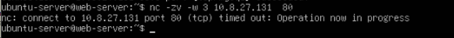

### Evidencia 14 — Deep Packet Inspection

Configuración del perfil `custom-deep-inspection` utilizado para realizar inspección profunda del tráfico SSL/TLS.

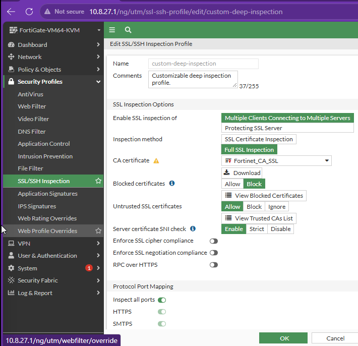

### Evidencia 15 — Registro de inspección SSL

Registro generado por FortiGate durante el procesamiento del tráfico HTTPS mediante el perfil de inspección configurado.

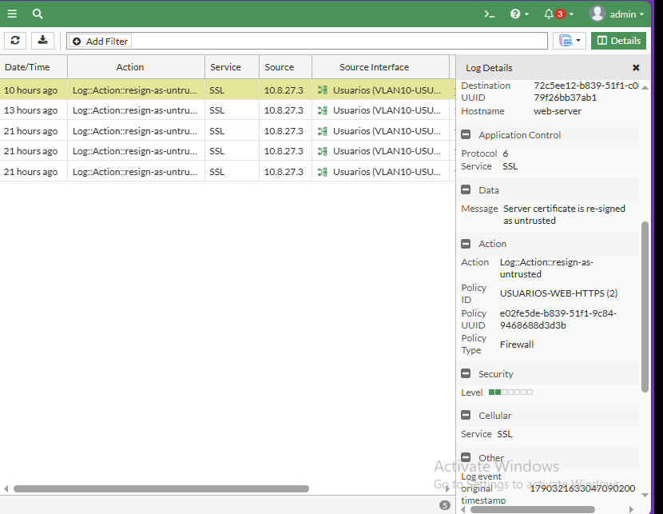

### Evidencia 16 — Protección contra SQL Injection

Configuración del perfil IPS `SQL-INJECTION-PROTECTION` con la firma utilizada para detectar y bloquear intentos de SQL Injection.

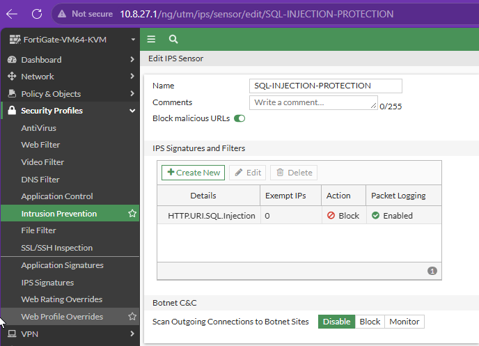

### Evidencia 17 — Detección y bloqueo de SQL Injection

Registro de Intrusion Prevention donde FortiGate identifica el evento `HTTP.URI.SQL.Injection` y aplica la acción de bloqueo.

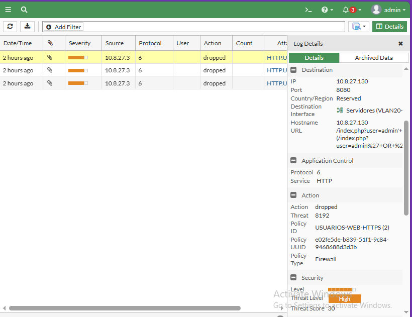

### Evidencia 18 — File Filter para archivos ejecutables

Configuración del perfil `BLOCK-EXE-DOWNLOADS` utilizado para bloquear archivos ejecutables `.exe`.

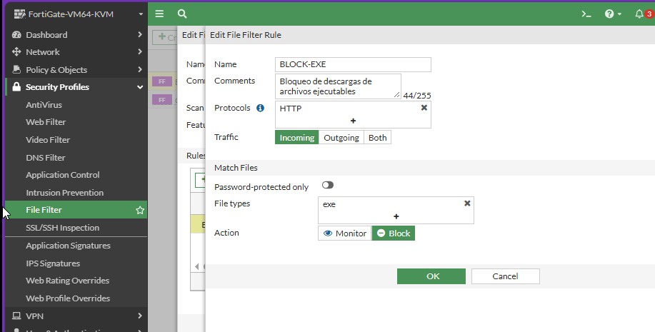

### Evidencia 19 — Bloqueo del archivo `prueba.exe`

Página de reemplazo mostrada por FortiGate al bloquear la descarga del archivo ejecutable utilizado durante la prueba.

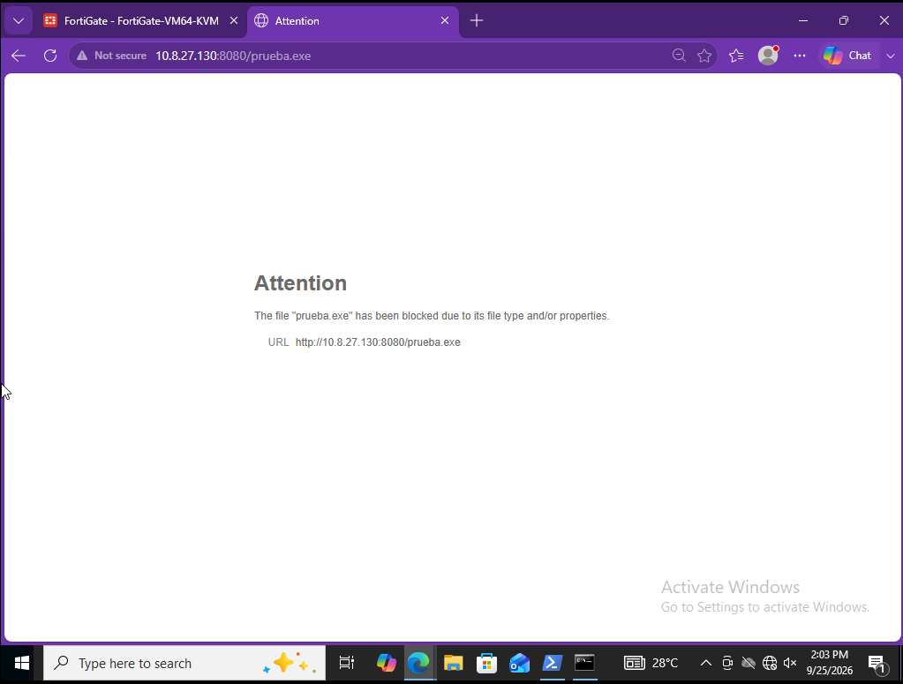

### Evidencia 20 — Registro del archivo bloqueado

Registro de File Filter donde se comprueba el bloqueo de `prueba.exe` con la acción `blocked`.

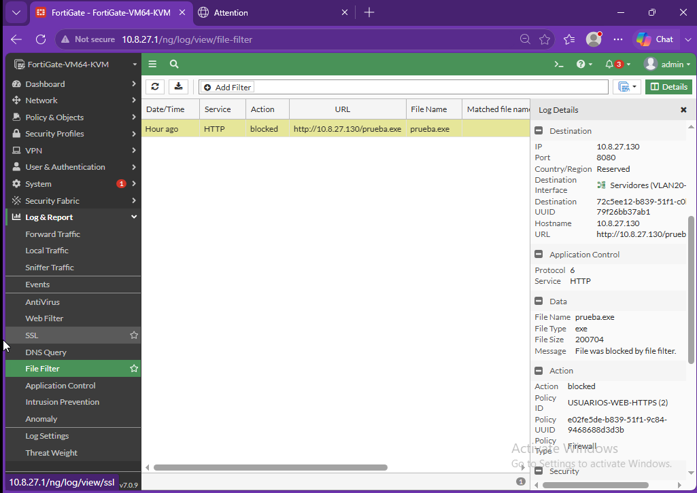

### Evidencia 21 — Protección DoS

Configuración de la política `PROTECCION-DOS-WEB`, incluyendo la protección `tcp_syn_flood`, acción Block y el umbral establecido.

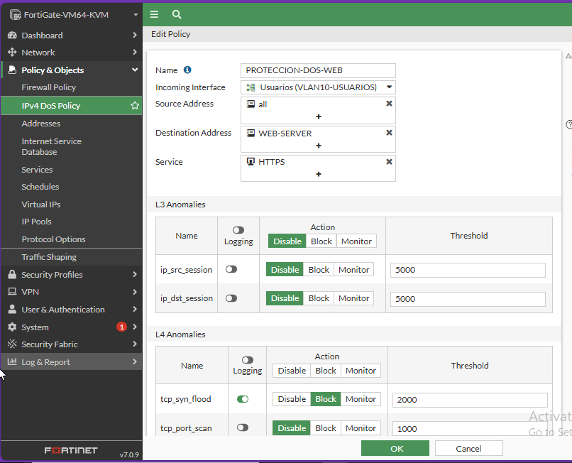

### Evidencia 22 — VLANs del switch

Verificación de las VLANs configuradas y de los puertos asociados a cada segmento de la red.

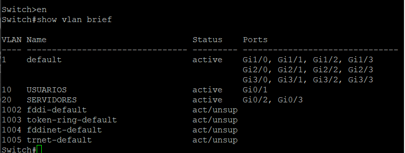

### Evidencia 23 — Enlace trunk

Verificación del enlace trunk utilizado entre el switch y FortiGate para transportar las VLAN 10 y VLAN 20.

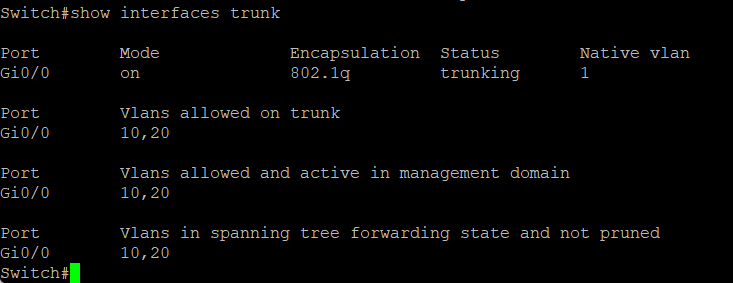

### Evidencia 24 — Port Security

Verificación de Port Security en los puertos de acceso utilizados por los dispositivos del laboratorio.

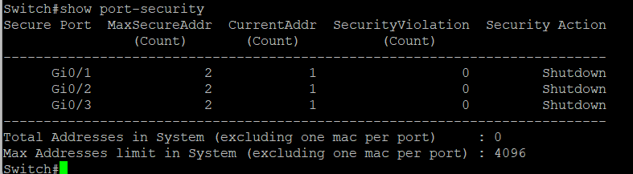

### Evidencia 25 — Puertos no utilizados deshabilitados

Verificación del estado de las interfaces del switch, donde se observan los puertos utilizados y los puertos no necesarios deshabilitados administrativamente.

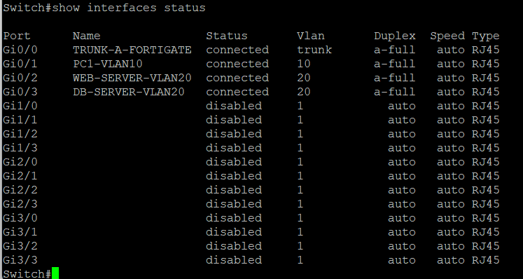

---

## Running Configurations

En esta sección se presentan las configuraciones principales utilizadas durante la implementación del laboratorio.

Los archivos de configuración se encuentran organizados en:

- `RUNNING-CONFIGS/Switch-running-config.txt`
- `RUNNING-CONFIGS/FortiGate-running-config.conf`

### Bloques relevantes de FortiOS

Las siguientes configuraciones corresponden a los principales elementos implementados en FortiGate.

### Interfaces y VLANs
```text
config system interface
    edit "port1"
        set vdom "root"
        set mode dhcp
        set allowaccess ping https ssh http
        set type physical
    next

    edit "port2"
        set vdom "root"
        set type physical
    next

    edit "port3"
        set vdom "root"
        set ip 192.168.244.2 255.255.255.0
        set allowaccess ping https ssh http
        set type physical
    next

    edit "VLAN10-USUARIOS"
        set vdom "root"
        set ip 10.8.27.1 255.255.255.128
        set allowaccess ping https http
        set alias "Usuarios"
        set device-identification enable
        set role lan
        set interface "port2"
        set vlanid 10
    next

    edit "VLAN20-SERVERS"
        set vdom "root"
        set ip 10.8.27.129 255.255.255.240
        set allowaccess ping
        set alias "Servidores"
        set device-identification enable
        set role lan
        set interface "port2"
        set vlanid 20
    next
end
```

### DHCP — VLAN 10 Usuarios
```text
config system dhcp server
    edit 2
        set dns-service default
        set default-gateway 10.8.27.1
        set netmask 255.255.255.128
        set interface "VLAN10-USUARIOS"
        config ip-range
            edit 1
                set start-ip 10.8.27.2
                set end-ip 10.8.27.126
            next
        end
    next
end
```

### Ruta por defecto

La interfaz WAN `port1` se encuentra configurada mediante DHCP. Por esta razón, la ruta por defecto hacia la red externa es obtenida dinámicamente a través de la configuración recibida por esta interfaz.

Al consultar la configuración de rutas estáticas, no aparece una ruta configurada manualmente, ya que la salida predeterminada es aprendida mediante DHCP.

### Objetos de los servidores
```text
config firewall address
    edit "WEB-SERVER"
        set associated-interface "VLAN20-SERVERS"
        set subnet 10.8.27.130 255.255.255.255
    next

    edit "DB-SERVER"
        set associated-interface "VLAN20-SERVERS"
        set subnet 10.8.27.131 255.255.255.255
    next
end
```

### Políticas de Firewall y NAT
```text
config firewall policy
    edit 1
        set name "SERVERS-INTERNET"
        set srcintf "VLAN20-SERVERS"
        set dstintf "port1"
        set action accept
        set srcaddr "all"
        set dstaddr "all"
        set schedule "always"
        set service "ALL"
        set nat enable
    next

    edit 2
        set name "USUARIOS-WEB-HTTPS"
        set srcintf "VLAN10-USUARIOS"
        set dstintf "VLAN20-SERVERS"
        set action accept
        set srcaddr "all"
        set dstaddr "WEB-SERVER"
        set schedule "always"
        set service "HTTPS" "TCP-8080"
        set utm-status enable
        set inspection-mode proxy
        set profile-protocol-options "CUSTOM-WEB-PORTS"
        set ssl-ssh-profile "custom-deep-inspection"
        set file-filter-profile "BLOCK-EXE-DOWNLOADS"
        set ips-sensor "SQL-INJECTION-PROTECTION"
        set logtraffic all
    next

    edit 3
        set name "BLOQUEO-USUARIOS-DB"
        set srcintf "VLAN10-USUARIOS"
        set dstintf "VLAN20-SERVERS"
        set srcaddr "all"
        set dstaddr "DB-SERVER"
        set schedule "always"
        set service "MYSQL"
        set logtraffic all
    next
end
```

### Servicio personalizado TCP/8080
```text
config firewall service custom
    edit "TCP-8080"
        set tcp-portrange 8080
    next
end
```

### Deep Packet Inspection (DPI)
```text
config firewall ssl-ssh-profile
    edit "custom-deep-inspection"
        set comment "Customizable deep inspection profile."

        config ssl
            set inspect-all deep-inspection
        end

        config https
        end

        config ftps
        end

        config imaps
        end

        config pop3s
        end

        config smtps
        end

        config ssh
            set ports 22
            set status disable
        end

        config dot
            set status deep-inspection
        end
    next
end
```

### IPS — Protección contra SQL Injection

El sensor IPS utiliza la regla correspondiente a la firma `HTTP.URI.SQL.Injection`, configurada para bloquear y registrar el tráfico detectado.
```text
config ips sensor
    edit "SQL-INJECTION-PROTECTION"
        set block-malicious-url enable

        config entries
            edit 2
                set rule 15621
                set status enable
                set log-packet enable
                set action block
            next
        end
    next
end
```

### File Filter — Bloqueo de archivos `.exe`
```text
config file-filter profile
    edit "BLOCK-EXE-DOWNLOADS"
        set comment "Bloqueo de archivos ejecutables para usuarios"

        config rules
            edit "BLOCK-EXE"
                set comment "Bloqueo de descargas de archivos ejecutables"
                set protocol http
                set action block
                set direction incoming
                set file-type "exe"
            next
        end
    next
end
```

### Protección DoS
```text
config firewall DoS-policy
    edit 1
        set name "PROTECCION-DOS-WEB"
        set interface "VLAN10-USUARIOS"
        set srcaddr "all"
        set dstaddr "WEB-SERVER"
        set service "HTTPS"

        config anomaly
            edit "tcp_syn_flood"
                set status enable
                set log enable
                set action block
                set threshold 2000
            next
        end
    next
end
```

Estos bloques representan las configuraciones principales utilizadas en FortiGate para implementar la segmentación, direccionamiento, control de acceso, inspección de tráfico y mecanismos de protección requeridos en el laboratorio.

---

## Scripts y archivos utilizados

Durante las pruebas del laboratorio se utilizaron herramientas y archivos auxiliares para validar el funcionamiento de los controles de seguridad implementados.

Estos recursos se encuentran organizados en la carpeta:

`SCRIPTS/`

### Servidor HTTP temporal

Durante las pruebas controladas se utilizó un servidor HTTP temporal en el WEB Server mediante el puerto TCP/8080.

Este servicio fue utilizado exclusivamente dentro del entorno de laboratorio para facilitar las pruebas relacionadas con:

- Detección y bloqueo de SQL Injection mediante IPS.
- Validación del perfil `SQL-INJECTION-PROTECTION`.
- Comprobación del bloqueo de archivos ejecutables mediante File Filter.
- Validación del perfil `BLOCK-EXE-DOWNLOADS`.

El puerto TCP/8080 fue habilitado en la política `USUARIOS-WEB-HTTPS` durante estas pruebas para permitir que el tráfico de validación atravesara FortiGate y pudiera ser inspeccionado por los perfiles de seguridad configurados.

### Archivo de prueba

Para comprobar el funcionamiento del File Filter se utilizó el archivo:

`prueba.exe`

Este archivo fue utilizado únicamente como archivo de prueba dentro del entorno controlado del laboratorio.

Al intentar acceder al archivo desde el equipo Windows de la VLAN 10, FortiGate identificó el tipo de archivo y bloqueó la transferencia mediante el perfil `BLOCK-EXE-DOWNLOADS`.

El evento quedó registrado en **Log & Report → File Filter** con la acción `blocked`.

### Archivos de configuración

También se almacenan en el repositorio los archivos correspondientes a las configuraciones principales de los dispositivos:

- `RUNNING-CONFIGS/Switch-running-config.txt`
- `RUNNING-CONFIGS/FortiGate-running-config.conf`

Estos archivos permiten consultar las configuraciones utilizadas durante la implementación y complementan las evidencias visuales incluidas en la documentación.

---

## Conclusión

Este laboratorio permitió implementar una infraestructura de red segmentada y protegida mediante FortiGate, integrando diferentes controles de seguridad para administrar la comunicación entre usuarios, servidores e Internet.

La utilización de VLANs permitió separar la red de usuarios de la red de servidores, mientras que las políticas de firewall establecieron qué comunicaciones se encuentran permitidas o bloqueadas. También se implementaron servicios y mecanismos como DHCP, NAT, HTTPS, Deep Packet Inspection, IPS, filtrado de archivos y protección frente a ataques DoS.

Además, se aplicaron controles adicionales en el switch y en los servidores, como Port Security y UFW, reforzando la seguridad de la infraestructura más allá de las políticas configuradas directamente en FortiGate.

Las pruebas realizadas permitieron comprobar el funcionamiento de los principales controles implementados, incluyendo el acceso HTTPS al WEB Server, el bloqueo del acceso directo al DB Server, la comunicación controlada entre los servidores, la inspección profunda del tráfico, la detección y bloqueo de SQL Injection, el filtrado de archivos ejecutables y las medidas de protección configuradas para el servicio web.

En conjunto, la práctica permitió aplicar diferentes mecanismos de seguridad dentro de una misma infraestructura y comprobar cómo la segmentación, el control de acceso, la inspección del tráfico y la protección de los dispositivos trabajan de forma complementaria para reducir los riesgos dentro de una red.
